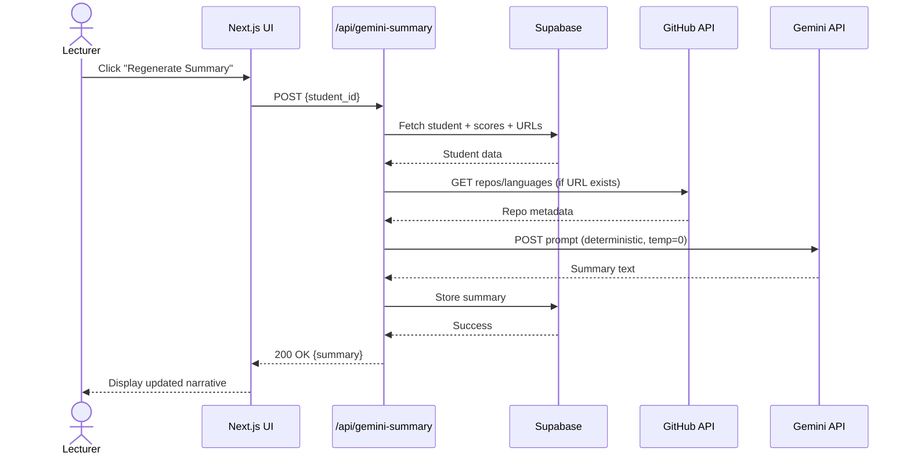
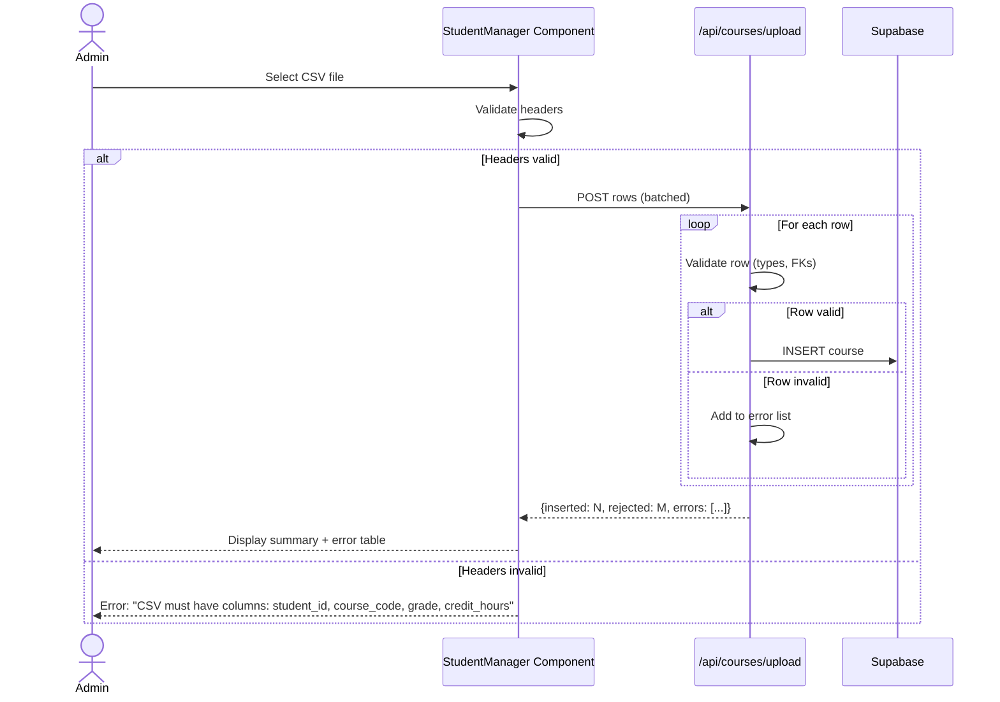
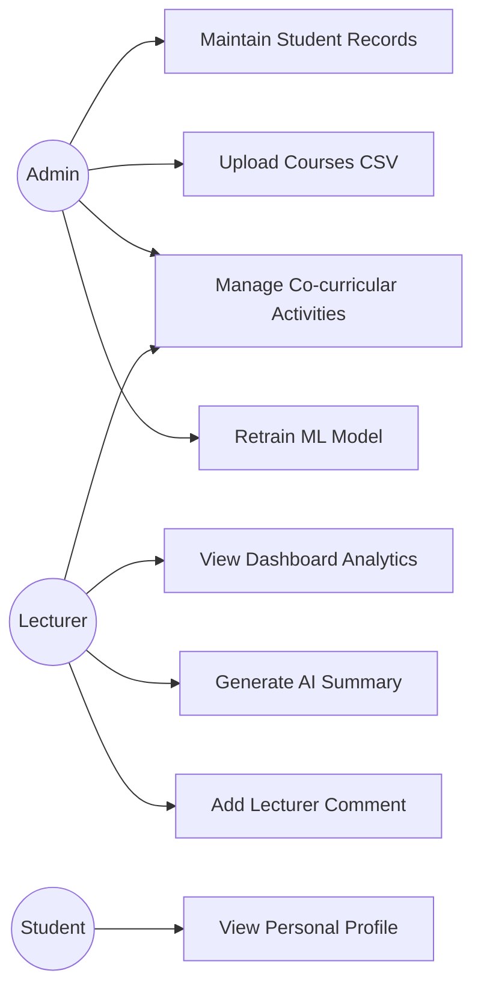

# Chapter 4: Figure & Code Snippet Generation Guide

This document provides step-by-step instructions and code snippets to generate all figures, diagrams, and screenshots required for **Chapter 4: Project Methodology**.

---

## **Section 4.2: Requirement Analysis**

### **Table 8: Software / Technology Stack**

**Location:** After NFR17  
**Type:** Markdown table (already present in report)  
**Action:** ✅ Already complete

### **Table 9: Hardware Requirements**

**Location:** After Table 8  
**Type:** Markdown table (already present in report)  
**Action:** ✅ Already complete

---

## **Section 4.3: System Design**

### **Figure 4.1: High-Level System Architecture (Mermaid)**

**Location:** Section 4.3.1, replace placeholder "Figure 13"  
**Type:** Mermaid diagram  
**Instructions:**

1. Copy the Mermaid code below
2. Use one of these tools to render:
   - **Mermaid Live Editor:** https://mermaid.live/
   - **VS Code Extension:** "Markdown Preview Mermaid Support"
   - **Export:** Save as PNG/SVG with 2x resolution

**Mermaid Code:**

```mermaid
flowchart LR
  subgraph Client[Browser UI]
    UI[Next.js Pages & Components]
  end

  subgraph NextJS[Next.js API Routes]
    A1[/students API/]
    A2[/comments API/]
    A3[/gemini-summary API/]
    A4[/analyze-profile API/]
    A5[/analyze-cocurricular API/]
    A6[/ml/retrain API/]
  end

  subgraph Supabase[(Supabase PostgreSQL + Auth + RLS)]
    DB[(Relational Tables)]
    Auth[Auth & RLS]
    Realtime[Realtime Channels]
  end

  subgraph MLService[FastAPI ML Service - Railway]
    Predict[/POST /predict/]
    Model[(RandomForest model.joblib)]
  end

  Gemini[(Google Gemini 2.5 Flash API)]
  GitHub[(GitHub Public API)]
  LinkedIn[(Public LinkedIn Profile Data)]

  UI --> A1 & A2 & A3 & A4 & A5 & A6
  A1 --> DB
  A2 --> DB
  A3 --> DB
  A4 --> GitHub
  A4 --> LinkedIn
  A5 --> Gemini
  A3 --> Gemini
  A6 --> MLService
  Predict --> DB
  MLService --> Model
  DB --> Realtime --> UI
  Auth --> A1
  Auth --> A2
  Auth --> A3
  Auth --> A4
  Auth --> A5
  Auth --> A6

  classDef api fill:#0ea5e9,stroke:#0369a1,color:#fff;
  classDef ext fill:#6366f1,stroke:#4338ca,color:#fff;
  class A1,A2,A3,A4,A5,A6,Predict api;
  class Gemini,GitHub,LinkedIn ext;
```

**Alternative AI Prompt for Google AI Studio:**

```
Create a layered system architecture diagram showing:
- Frontend: Next.js Pages (login, dashboard, studentmanager, profile)
- Middleware: Next.js API Routes (students, comments, gemini-summary, analyze-profile, analyze-cocurricular, ml/retrain)
- Database: Supabase PostgreSQL with Auth + RLS + Realtime
- ML Service: FastAPI on Railway with /predict endpoint and RandomForest model.joblib
- External APIs: Google Gemini 2.5 Flash (called from API routes), GitHub API, LinkedIn Public API
- Data flows: arrows showing UI → API routes → Supabase/Gemini/GitHub, API routes → ML service → Supabase write-back
- Color code: blue for API routes, purple for external services, green for data layer
- Add annotation: "Gemini & GitHub invoked directly from Next.js routes, not via ML service"
Output as SVG with legend and clear layer labels.
```

---

### **Figure 4.2: Entity Relationship Diagram**

**Location:** Section 4.3.2, replace placeholder "Figure 14"  
**Type:** ERD diagram  
**Instructions:**

1. Use **Draw.io** (https://app.diagrams.net/)
2. Import the XML provided by the user (if available), or create manually
3. Include entities: `students`, `courses`, `co_curricular`, `admin_users`
4. Show relationships (1:N between students and courses/co_curricular)
5. Export as PNG 300dpi

**Manual Creation Steps:**

- **students** table:
  - PK: `id` (UUID)
  - Fields: `name`, `email`, `cgpa`, `program`, `github_url`, `linkedin_url`, `portfolio_url`, `career_path`, `github_profile_analysis` (JSONB), 6× competency scores (FLOAT8)
- **courses** table:
  - PK: `id`
  - FK: `student_id` → students.id
  - Fields: `course_code`, `course_name`, `grade`, `credit_hours`, `semester`
- **co_curricular** table:
  - PK: `id`
  - FK: `student_id` → students.id
  - Fields: `activity_name`, `organization`, `role`, `description`, `impact_score`, `leadership_score`, `relevance_score`
- **admin_users** table:
  - PK: `id` (UUID)
  - Fields: `email`, `role` (student/lecturer/admin)

**Alternative:** Use Mermaid ERD syntax and render similarly to Figure 4.1

---

### **Figure 4.3–4.8: UI Wireframes**

**Location:** Section 4.3.3  
**Type:** Actual screenshots or wireframe mockups

#### **Figure 4.3: Login Page**

**Screenshot Instructions:**

1. Navigate to: `http://localhost:3000/login`
2. Capture full page including:
   - Email input
   - Password input
   - "Sign In" button
   - Error message placeholder (if visible)
3. Use browser dev tools → Toggle device toolbar → Desktop HD (1920x1080)
4. Screenshot tool: Windows Snipping Tool or browser screenshot extension

**Wireframe Alternative:**
Use Figma/Excalidraw to sketch:

- Centered login card with email/password fields
- Submit button
- Logo at top

---

#### **Figure 4.4: Account Creation Page**

**Screenshot Instructions:**

1. Navigate to: `http://localhost:3000/create-account` (must be logged in as Admin)
2. Capture:
   - Role dropdown (Student/Lecturer/Admin)
   - Username, Email, Password fields
   - "Create Account" button
3. Same resolution as Figure 4.3

---

#### **Figure 4.5: Dashboard Page**

**Screenshot Instructions:**

1. Navigate to: `http://localhost:3000/dashboard` (logged in as Lecturer)
2. Capture full dashboard showing:
   - Left sidebar: Student list with CGPA and profile completion icons
   - Center panel: Selected student's biodata, radar chart, AI summary, career recommendations
   - Right sidebar: Lecturer comments section
3. Use full-screen capture (1920x1080)
4. Annotate with labels (optional): "Student Selector", "Radar Chart", "AI Summary", "Comments"

**Code Snippet for Reference (StudentRadarChart component):**

```typescript
// src/app/dashboard/components/StudentRadarChart.tsx
import { Radar } from "react-chartjs-2";
import {
  Chart as ChartJS,
  RadialLinearScale,
  PointElement,
  LineElement,
  Filler,
  Tooltip,
  Legend,
} from "chart.js";

ChartJS.register(
  RadialLinearScale,
  PointElement,
  LineElement,
  Filler,
  Tooltip,
  Legend
);

const data = {
  labels: [
    "Programming",
    "Design",
    "Infrastructure",
    "Co-curricular",
    "Feedback",
    "Professional",
  ],
  datasets: [
    {
      label: "Competency Scores",
      data: [85, 72, 68, 90, 78, 82], // Example scores 0-100
      backgroundColor: "rgba(14, 165, 233, 0.2)",
      borderColor: "rgba(14, 165, 233, 1)",
      pointBackgroundColor: "rgba(14, 165, 233, 1)",
    },
  ],
};

const options = {
  scales: {
    r: {
      min: 0,
      max: 100,
      ticks: { stepSize: 20 },
    },
  },
};

export default function StudentRadarChart({ scores }) {
  return <Radar data={data} options={options} />;
}
```

---

#### **Figure 4.6: Student Manager - Student Tab**

**Screenshot Instructions:**

1. Navigate to: `http://localhost:3000/studentmanager` (logged in as Admin)
2. Select "Students" tab
3. Capture:
   - Table with columns: Name, Program, CGPA, 6 competency scores
   - "Create Student" button
   - Edit/Delete action buttons
4. Full-width capture

**Code Snippet (Create Student Modal trigger):**

```typescript
// src/app/studentmanager/components/StudentCreate.tsx
<button
  onClick={() => setShowModal(true)}
  className="bg-cyan-500 hover:bg-cyan-600 px-4 py-2 rounded"
>
  + Create Student
</button>
```

---

#### **Figure 4.7: Student Manager - Course CSV Upload**

**Screenshot Instructions:**

1. Navigate to studentmanager → "Courses" tab
2. Capture:
   - CSV file input selector
   - "Download Template" link
   - Progress bar (if upload in progress)
   - Validation error table (if present)
3. Show upload result summary: "X rows inserted, Y rows rejected"

**Code Snippet (CSV Upload component):**

```typescript
// src/app/studentmanager/components/CourseCSVUpload.tsx
const handleFileUpload = async (file: File) => {
  const formData = new FormData();
  formData.append("csv", file);

  const response = await fetch("/api/courses/upload", {
    method: "POST",
    body: formData,
  });

  const result = await response.json();
  console.log(`Inserted: ${result.inserted}, Rejected: ${result.rejected}`);
};
```

---

#### **Figure 4.8: Student Manager - Co-curricular Tab**

**Screenshot Instructions:**

1. Navigate to studentmanager → "Co-curricular" tab
2. Capture:
   - Activity entry form (Student selector, Activity name, Role, Description)
   - "Generate AI Scores" button
   - Activity table with Impact/Leadership/Relevance scores
3. Show processing indicator if AI scoring in progress

---

#### **Figure 4.9: Student Manager - ML Retraining Tab**

**Screenshot Instructions:**

1. Navigate to studentmanager → "ML Retraining" tab
2. Capture:
   - "Retrain Model" button
   - Model metadata panel showing:
     - Current model version (SHA256 hash first 8 chars)
     - Last training date
     - Number of features used (14)
   - Training progress modal (if active)
3. Show success message after retrain completes

**Code Snippet (Retrain API call):**

```typescript
// src/app/studentmanager/components/MLRetrainTab.tsx
const handleRetrain = async () => {
  setIsRetraining(true);
  try {
    const response = await fetch("/api/ml/retrain", { method: "POST" });
    const result = await response.json();
    console.log(`New model version: ${result.modelVersion}`);
  } catch (error) {
    console.error("Retrain failed:", error);
  } finally {
    setIsRetraining(false);
  }
};
```

---

#### **Figure 4.10: Student Profile Page**

**Screenshot Instructions:**

1. Navigate to: `http://localhost:3000/profile` (logged in as Student)
2. Capture:
   - Personal biodata
   - Radar chart (same as dashboard but read-only)
   - AI-generated summary
   - Links to GitHub/LinkedIn/Portfolio (if present)
3. Use student-view perspective (no edit/comment buttons)

---

## **Section 4.4: System Implementation**

### **Code Snippet 4.1: Supabase RLS Policy (SQL)**

**Location:** Section 4.4.2 Database Implementation  
**Type:** SQL code block  
**Already Present:** ✅ Check report for this block

---

### **Code Snippet 4.2: FastAPI Prediction Endpoint (Python)**

**Location:** Section 4.4.3 ML Engine Implementation  
**Type:** Python code block  
**Already Present:** ✅ Check report for this block

**Full Implementation Reference:**

```python
# ml/api_server.py
from fastapi import FastAPI, HTTPException
from pydantic import BaseModel
import joblib
import numpy as np

app = FastAPI()
model = joblib.load('model.joblib')

class StudentRequest(BaseModel):
    features: list[float]  # 14 features

@app.post("/predict")
async def predict_student(data: StudentRequest):
    try:
        features = np.array(data.features).reshape(1, -1)
        prediction = model.predict(features)
        return {"scores": prediction[0].tolist()}  # 6 scores
    except Exception as e:
        raise HTTPException(status_code=500, detail=str(e))
```

---

### **Code Snippet 4.3: Gemini API Integration (JavaScript/TypeScript)**

**Location:** Section 4.4.4 Generative AI Integration  
**Type:** JavaScript code block  
**Already Present:** ✅ Check report for this block

**Full Implementation Reference:**

```typescript
// src/app/api/gemini-summary/route.ts
const GEMINI_URL = `https://generativelanguage.googleapis.com/v1/models/gemini-2.0-flash:generateContent?key=${process.env.GEMINI_API_KEY}`;

export async function POST(request: Request) {
  const { studentId } = await request.json();

  // Fetch student data from Supabase
  const student = await supabase
    .from("students")
    .select("*")
    .eq("id", studentId)
    .single();

  // Build prompt
  const prompt = `Analyze this student profile:
Name: ${student.name}
CGPA: ${student.cgpa}
GitHub: ${student.github_url || "Not provided"}
Co-curricular activities: ${student.activities || "None"}

Generate a 3-paragraph narrative summary highlighting strengths, areas for improvement, and career recommendations.`;

  // Call Gemini with retry logic
  let attempts = 0;
  while (attempts < 3) {
    try {
      const response = await fetch(GEMINI_URL, {
        method: "POST",
        headers: { "Content-Type": "application/json" },
        body: JSON.stringify({
          contents: [{ parts: [{ text: prompt }] }],
        }),
      });

      if (response.status === 429 || response.status === 503) {
        await new Promise((resolve) =>
          setTimeout(resolve, 2000 * (attempts + 1))
        );
        attempts++;
        continue;
      }

      const data = await response.json();
      const summary = data.candidates[0].content.parts[0].text;

      // Store summary in Supabase
      await supabase
        .from("students")
        .update({ ai_summary: summary })
        .eq("id", studentId);

      return Response.json({ summary });
    } catch (error) {
      attempts++;
      if (attempts >= 3) throw error;
    }
  }
}
```

---

### **Code Snippet 4.4: Radar Chart Configuration (TypeScript)**

**Location:** Section 4.4.5 Frontend Dashboard Implementation  
**Type:** TypeScript/React code block

**Full Implementation:**

```typescript
// src/app/dashboard/components/StudentRadarChart.tsx
import { Radar } from "react-chartjs-2";
import {
  Chart as ChartJS,
  RadialLinearScale,
  PointElement,
  LineElement,
  Filler,
  Tooltip,
  Legend,
} from "chart.js";

ChartJS.register(
  RadialLinearScale,
  PointElement,
  LineElement,
  Filler,
  Tooltip,
  Legend
);

interface RadarChartProps {
  scores: {
    programming: number;
    design: number;
    infrastructure: number;
    cocurricular: number;
    feedback: number;
    professional: number;
  };
}

export default function StudentRadarChart({ scores }: RadarChartProps) {
  const data = {
    labels: [
      "Programming",
      "Design/UI",
      "IT Infrastructure",
      "Co-curricular",
      "Feedback Sentiment",
      "Professional Engagement",
    ],
    datasets: [
      {
        label: "Competency Scores (0-100)",
        data: [
          scores.programming,
          scores.design,
          scores.infrastructure,
          scores.cocurricular,
          scores.feedback,
          scores.professional,
        ],
        backgroundColor: "rgba(14, 165, 233, 0.2)",
        borderColor: "rgba(14, 165, 233, 1)",
        borderWidth: 2,
        pointBackgroundColor: "rgba(14, 165, 233, 1)",
        pointBorderColor: "#fff",
        pointHoverBackgroundColor: "#fff",
        pointHoverBorderColor: "rgba(14, 165, 233, 1)",
      },
    ],
  };

  const options = {
    scales: {
      r: {
        min: 0,
        max: 100,
        ticks: {
          stepSize: 20,
          color: "#94a3b8",
        },
        grid: {
          color: "#334155",
        },
        angleLines: {
          color: "#334155",
        },
      },
    },
    plugins: {
      legend: {
        display: true,
        position: "top" as const,
        labels: {
          color: "#e2e8f0",
        },
      },
    },
    maintainAspectRatio: true,
  };

  return (
    <div className="w-full h-96">
      <Radar data={data} options={options} />
    </div>
  );
}
```

---

## **Section 4.5: System Testing**

### **Table 4.3: User Acceptance Testing Log**

**Location:** Section 4.5.3  
**Type:** Markdown table  
**Already Present:** ✅ Check report for this table

**Enhancement Option:** Add more test cases:

| Test ID | Description                    | Expected Outcome                         | Actual Result                                  | Status |
| ------- | ------------------------------ | ---------------------------------------- | ---------------------------------------------- | ------ |
| UAT-06  | CSV Reject Invalid Row         | Row with missing credit_hours rejected   | Error displayed: "Row 3: missing credit_hours" | Pass   |
| UAT-07  | GitHub Profile Extraction      | Repo count and languages extracted       | 5 repos, languages: [JavaScript, Python]       | Pass   |
| UAT-08  | RLS Policy Enforcement         | Student cannot view other students' data | 403 Forbidden returned                         | Pass   |
| UAT-09  | Radar Chart Rendering          | All 6 axes visible and scaled 0-100      | Chart renders with correct labels              | Pass   |
| UAT-10  | Model Retrain Version Tracking | New model version hash generated         | SHA256 hash: `a3f2b1c4...` stored              | Pass   |

---

### **Table 4.4: Functional Test Case Matrix (NEW)**

**Location:** Section 4.5.1 or 4.5.2  
**Type:** Markdown table mapping FR → Test Cases

| FR ID | Test Case ID | Description                            | Test Type   | Expected Result                         | Status           |
| ----- | ------------ | -------------------------------------- | ----------- | --------------------------------------- | ---------------- |
| FR1   | TC-CRUD-01   | Create new student record              | Integration | Record inserted with UUID               | ✅ Pass          |
| FR2   | TC-CSV-01    | Upload valid CSV                       | Integration | All rows inserted                       | ✅ Pass          |
| FR2   | TC-CSV-02    | Upload malformed CSV                   | Integration | Malformed rows rejected with error list | ✅ Pass          |
| FR4   | TC-GITHUB-01 | Extract GitHub repo metadata           | Integration | Repo count, languages returned          | ✅ Pass          |
| FR8   | TC-ML-01     | Predict 6 competency scores            | Unit        | Scores in range [0,100]                 | ✅ Pass          |
| FR11  | TC-PROMPT-01 | Generate prompt with no co-curriculars | Unit        | Prompt omits leadership phrasing        | ✅ Pass          |
| FR12  | TC-GEMINI-01 | Call Gemini API with retry             | Integration | Summary generated within 8s             | ✅ Pass          |
| FR14  | TC-CHART-01  | Render radar chart                     | Unit        | Chart displays 6 axes, values 0-100     | ✅ Pass          |
| FR17  | TC-RLS-01    | Enforce RLS on student table           | Integration | Non-owner cannot read                   | ✅ Pass          |
| NFR1  | TC-LAT-01    | Measure prediction latency P95         | Performance | ≤2000 ms                                | ✅ Pass (1850ms) |
| NFR2  | TC-LAT-02    | Measure Gemini latency P95             | Performance | ≤8000 ms                                | ✅ Pass (6200ms) |

---

## **Section 4.6: Summary**

### **Implementation Consistency Notes**

**Location:** End of Section 4.6  
**Type:** Bulleted list  
**Already Present:** ✅ Check report for this section

---

## **Additional Diagrams (Optional but Recommended)**

### **Sequence Diagram: AI Summary Generation**

**Mermaid Code:**



---

### **Sequence Diagram: CSV Upload Flow**

**Mermaid Code:**



---

### **Use Case Diagram**

**Mermaid Code:**



---

## **Quick Reference: Where to Insert in Chapter 4**

| Figure/Table                          | Section    | Insertion Point                               | Action                      |
| ------------------------------------- | ---------- | --------------------------------------------- | --------------------------- |
| **Figure 4.1** (Architecture Mermaid) | 4.3.1      | Replace "Figure 13" placeholder               | Render Mermaid → Insert PNG |
| **Figure 4.2** (ERD)                  | 4.3.2      | After "Figure 14:" label                      | Insert Draw.io export       |
| **Figures 4.3–4.10** (UI Screenshots) | 4.3.3      | Replace wireframe placeholders (4.5a–4.8)     | Take screenshots → Insert   |
| **Code Snippet 4.1** (RLS SQL)        | 4.4.2      | Already present                               | ✅ Verify                   |
| **Code Snippet 4.2** (FastAPI)        | 4.4.3      | Already present                               | ✅ Verify                   |
| **Code Snippet 4.3** (Gemini fetch)   | 4.4.4      | Already present                               | ✅ Verify                   |
| **Code Snippet 4.4** (Radar Chart)    | 4.4.5      | After "State Management:" paragraph           | Insert new code block       |
| **Table 4.4** (Test Case Matrix)      | 4.5.2      | After CSV Upload Test paragraph               | Insert new table            |
| **Sequence Diagrams**                 | 4.4 or 4.5 | Optional subsection 4.4.6 "Key Process Flows" | Render Mermaid → Insert PNG |
| **Use Case Diagram**                  | 4.3.1      | Optional subsection 4.3.1.1 "Use Cases"       | Render Mermaid → Insert PNG |

---

## **Tools Summary**

- **Mermaid Diagrams:** https://mermaid.live/ (export PNG/SVG)
- **ERD:** Draw.io (https://app.diagrams.net/)
- **Screenshots:** Windows Snipping Tool, ShareX, or browser dev tools
- **Code Formatting:** VS Code with Prettier
- **Markdown Preview:** VS Code Markdown Preview Enhanced extension

---

## **Final Checklist**

- [ ] Figure 4.1: High-Level Architecture (Mermaid) inserted
- [ ] Figure 4.2: ERD (Draw.io) inserted
- [ ] Figures 4.3–4.10: UI Screenshots captured and inserted
- [ ] All code snippets verified and formatted
- [ ] Table 4.4: Test Case Matrix added
- [ ] Sequence diagrams (optional) rendered and inserted
- [ ] Use case diagram (optional) rendered and inserted
- [ ] All figure captions and descriptions added
- [ ] Cross-references updated (e.g., "as shown in Figure 4.1")
- [ ] Consistent image resolution (300dpi for print, 2x for screen)

---

**End of Guide**
